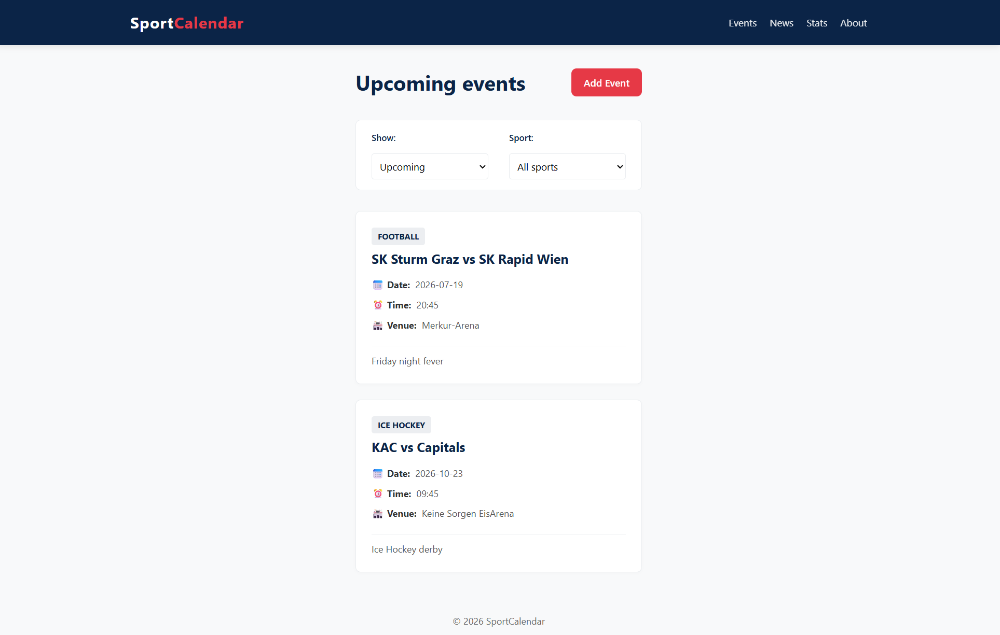
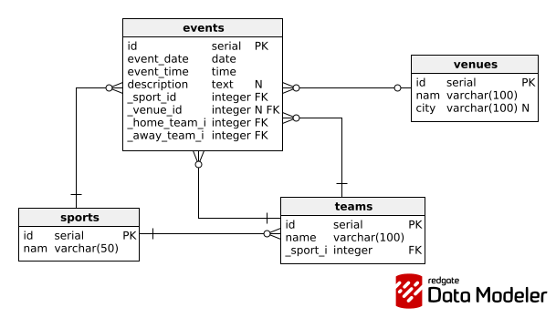

# Sports Event Calendar

A REST API for managing sports events built with NestJS, Prisma and PostgreSQL.

The project provides:

- a PostgreSQL database model for sports events,
- a NestJS backend API to create and fetch events,
- a simple frontend to list events and add a new one.

## Screenshots

### Frontend

<p align="center">
  
</p>

### ERD

<p align="center">
  
</p>

## Tech Stack

- NestJS (TypeScript)
- Prisma
- PostgreSQL
- HTML/CSS/JavaScript
- Docker + Docker Compose

## Features

- Create event
- Get all events
- Get upcoming and past events
- Get one event by ID
- Browse sports, teams, venues
- Frontend filters (range + sport)
- Add event form
- Swagger docs

## API Endpoints

- `POST /events` - creates a new event.
- `GET /events` - returns all events sorted by date.
- `GET /events/upcoming` - returns events with date >= today.
- `GET /events/past` - returns events with date < today.
- `GET /events/:id` - returns one event by ID.
- `GET /sports` - returns all sports.
- `GET /teams?sportId=<id>` - returns teams (optionally filtered by sport).
- `GET /venues` - returns all venues.

Swagger:

- [http://localhost:3000/api](http://localhost:3000/api)

## Run with Docker (recommended)

### 1) Build and start

```bash
docker compose up -d --build
```

### 2) Seed data

```bash
docker compose exec api pnpm tsx prisma/seed.ts
```

### 3) Open

- API: [http://localhost:3000](http://localhost:3000)
- Swagger: [http://localhost:3000/api](http://localhost:3000/api)

### 3a) Open frontend

Frontend is static and located in `frontend/`.
API URL for frontend is configured in `frontend/config.js` (`apiBaseUrl`).

You can open:

- `frontend/index.html` (events list)
- `frontend/add-event.html` (add event form)

### 4) Stop

```bash
docker compose down
```

Full reset (remove DB volume):

```bash
docker compose down -v
```

## Run locally

### 1) Install dependencies

```bash
pnpm install
```

### 2) Create `.env`

```env
PORT=3000
DATABASE_URL="postgresql://<user>:<password>@localhost:5432/<db_name>?schema=public"
```

### 3) Migrate, generate, seed

```bash
pnpm prisma migrate deploy
pnpm prisma generate
pnpm tsx prisma/seed.ts
```

### 4) Start backend

```bash
pnpm start:dev
```

## Tests (E2E)

```bash
pnpm test:e2e
```

## Assumptions

- **Validation:** Event must have two different teams (`homeTeamId` != `awayTeamId`).
- **Sport Consistency:** Both teams in an event must belong to the selected `sportId` (validated on backend during event creation).
- **Date Handling:** "Upcoming" and "Past" events are filtered using the server current date.
- **Optional Venue:** Venue is optional (for "to be announced" or neutral scenarios).
- **Data Integrity:** Foreign keys in database use underscore-prefixed names (for example `_sport_id`), matching exercise requirements.

## Architectural Decisions (ADR)

### 001: Backend - NestJS

**Decision:** Selected NestJS.  
**Rationale:** It is a solid, modular framework for TypeScript. It provides good structure and validation support, which was a key focus in this task.

### 002: Database - PostgreSQL + Prisma (with Raw SQL)

**Decision:** PostgreSQL with Prisma ORM + Raw SQL.  
**Rationale:** The data model is highly relational. Prisma is used for schema and general data access, while Raw SQL is used in selected places (for example event listing with joins) to show SQL proficiency and keep queries efficient.

### 003: Frontend - Vanilla JS

**Decision:** Vanilla JS instead of React.  
**Rationale:** Even though I know React, I chose Vanilla JS to keep the project lightweight. This exercise is backend-focused, so a simple frontend was enough to demonstrate API usage.

### 004: Docker

**Decision:** Added Docker Compose.  
**Rationale:** It makes the project easier to run and review, because the whole stack (database + API) can be started with a single command.

## AI Usage

Information about AI usage is available in `AI_Reflection.txt`.
